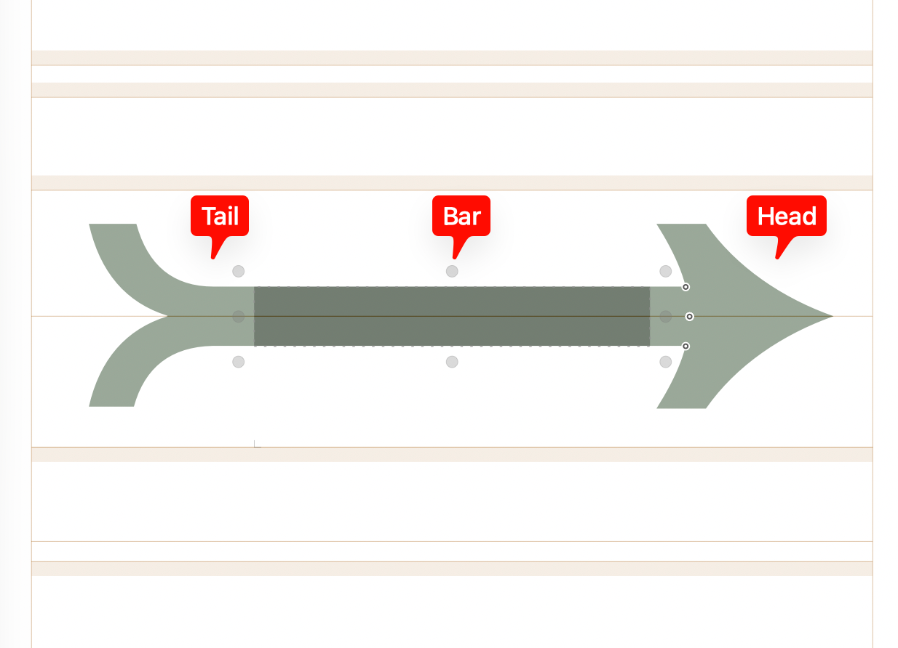

Todo: 

_smart.FrombarArrow needs fixing its width
Create 2? Dual middle pieces
Then put in the strokes as best you can.  
Think about how you want to deal with the recipes for these (split off or not?)
11. Fix up the tails and the heads!!!!!
4. leftHarpoonWithBarbDownBelowLongDash.lft is overcomplicated in what it is doing!
8. Adjust strokes of extendibles
11. ????Experiment Larger Head/Tail axis (only once Glyphs4 bug is fixed)

# Mathematical Arrow Notes

We will describe here the system used in to create a large number of mathematical arrows from a small number of so-called "composed components" that require designing by hand.    The system expects certain properties of these composed components, with more properties expected if you want to include more complicated features.

## Possible Features Supported within this system:
Ensuring that groups of horizontal arrows have the same length and that groups of vertical arrows have the same height
Support for Horizontal and Vertical Math Assembly
An ARLN axis that controls the length of horizontal arrows
An ARHT axis that controls the height of horizontal arrows
An ARHD axis that controls the size of the arrow head
An ARTL axis that controls the size of the arrow tail

## Horizontal Components

Each horizontal arrow consists of three components left/middle/right.  So for \rightarrow these would be tail/bar/head and for \leftarrow they would be head/bar/tail.

## Horizontal Heads and Tails

Heads and Ends are divided into two sets called "Short" and "Long".  All the "Short" Heads and Ends are expected to have the same width, and all the "Long" Heads and Ends are expected to have the same width within a given master.  So, for instance, if there is a Black Master then all the Long Heads and all the Long Ends should have the same width in this master (this is not absolutely necessary, but if you do not do this then you have less control over the relative width of the arrows).

### Short Heads:  (340 in semicondensed; 450 in semiexpanded)
rightArrow.rgt
harpoonrightup.rgt
rightDoubleArrow.rgt
Arrowend.rgt

### Long Heads: (500 in semicondensed; 680 in semiexpanded)
twoheadrightarrow.rgt
rightTabHarpoonUpArrow.rgt
rightTabArrow.rgt
rightTabHarpoonUpArrow.rgt

### Short Ends: (340 in semicondensed; 450 in semiexpanded)
rightArrow.lft
FrombarArrowEnd.lft
FrombarDoubleArrowEnd.lft

### Long Ends:(500 in semicondensed; 680 in semiexpanded)
ArrowEnd.lft
?DoubleArrowEnd.lft
ArrowEnd.lft
needs #exit anchor

## Composed Components

The composed components are those that need to be designed directly, all point from left-to-right.   All composed head components should have LSB=0.  The RSB is a design choice that gives sidebearings to the arrow.   All composed End components should have RSB=0 and LSB as a design choice.  

The following components need to be composed.

### Smart Components

#### _smart.ArrowHead.top
LSB=0
RSB by design
Possible smart axis: weight, height
Useful to design so the weight=low have the same RSB and all weight=high have the same RSB
This glyph is flattened in the weight axis
#exit/#entry in the same place so that they align correctly in _smart.Arrow

#### _smart.ArrowHead
This can either be designed directly, or generated using two copies of _smart.Arrow.top with the second flipped in the y-direction to ensure symmetry
NOTES

#### _smart.Arrow.mid
This will be the horizontal bar of the horizontal arrows.  RSB=LSB=0.  It should have a "width" axis with a large range that agrees with its size in units (so a layer with width=30 should have width=30 for all masters and a layer with width=1000 should have width=1000).  Has #entry/#exit anchors on the border of the boundingbox, center aligned vertically.  Should be non-exporting.

#### _smart.DoubleArrow.mid
Similar to _smart.Arrow.mid this will be the double horizontal bars of the double horiztonal arrows.  LSB=RSB=0.  As the _smart.Arrow.mid it should have a width axis setup in the same way.   Has #entry/#exit anchors on the border of the boundingbox, center aligned vertically.   Should be non-exporting.

### ArrowEnds

#### _smart.ArrowEnd
This will be part of the tail of \rightArrow.  Should be non-exporting.  For design where most arrows do not have visible tails this could be just a bar, and you could use _smart.Arrow.mid for this.  For arrows with tails this should be designed.

#### ArrowEnd.lft 
This will be the End of rightArrow and (similar arrows). 
Consists of components _smart.ArrowEnd and _smart.Arrow.mid.   The internal axis of _smart.Arrow.mid should be set so this glyph has the desired width as described in Section ??.  RSB=0

#### DoubleArrowEnd.lft 
This will be the tail of \DoubleRightArrow and similar.   RSB=0.   

#### ArrowEnd.lft
This will be designed for arrows that have a visible tail.  For designes where most arrows do not have visible tails there will be a visible tail here.  For designs where most arrows have tails this will be a "double tail".  Can use components _smart.ArrowEnd and Arrow.mid if it is helpful.  RSB=0.

### FrombarComponents
Glyphs: FrombarArrowEnd.lft  

FrombarDoubleArrowEnd.lft

Design of the tails of FrombarArrow and FromDobuleArrow.  RSB=0.   LSB by design, but likely to be similar to each other.

### ArrowHeads
Glyphs: _smart.ArrowHead.top,_smart.ArrowHead,ArrowHead.rgt,
DoubleArrowHead.rgt
harpoonrightup.rgt
/twoheadrightarrow.rgt/

CHECK: Have a missed a component here?

 The others in the list are only used as components of these two and can be ommitted.    The _smart.ArrowHead.top can be the top half of the arrow, and the _smart.ArrowHead two copies of this one flipped in the y-direction to preserve symmetry.  Optional smart axes are width and height to enable variation of the arrows (and so that it can be reused for both ArrowHead and DoubleArrowHead.rgt).  

_smart.Arrowhead.top has identially placed #exit/#entry for placement in _smart.ArrowHead.   It also has %exit for placement of the bar in tab arrows such as rightTabHarpoonUpArrow.rgt and rightTabArrow.rgt.

rightDoubleArrow.rgt/rightTabHarpoonUpArrow.rgt/rightTabArrow.rgt
These can be semi-generated from the previous components and consist of a relevant head and a smart.Arrow.mid component so that their width is correct as described in Section ??.

### Others

#### Arrowend.rgt
This is a horiztonal bar with a right sidebar (LSB=0).  Used for glyphs such as ??

#### _ArrowTab

### _ArrowVerticalStroke, _ArrowDoubleVerticalStroke, _ArrowStroke
TBD if we actually use there

## Mid-Components
Todo: discuss these as it is a little more involved that one might think!
/ArrowStroke.mid/ArrowVerticalStroke.mid/ArrowDoubleVerticalStroke.mid/DoubleArrowStroke.mid/DoubleArrowVerticalStroke.mid/DoubleArrow.mid/Arrow.mid/DoubleArrowLong.mid/DoublePairedArrow.mid.  
They can all be set to non exporting.  RSB=LSB=0

## Generated Components
The following components can be generated from the above using recipes and are used in the arrows and the assemblies.  They can be set to non-exporting if math assembly is not used:

| Glyph | Glyph | Glyph |
|:------|:------|:------|
| `leftArrow.lft` | `leftArrow.rgt` | `leftTailArrow.rgt` |
| `leftFrombarArrow.rgt` | `leftTabArrow.lft` | `leftTabHarpoonDownArrow.lft` |
| `leftTabHarpoonUpArrow.lft` | `rightTabHarpoonDownArrow.rgt` | `leftDoubleArrow.lft` |
| `leftDoubleArrow.rgt` | `leftFrombarDoubleArrow.rgt` | `twoheadleftarrow.lft` |
| `leftHarpoonWithBarbDownBelowLongDash.rgt` | `leftHarpoonWithBarbUpAboveLeftHarpoonWithBarbDown.rgt` | `leftHarpoonWithBarbUpAboveLongDash.rgt` |
| `leftHarpoonWithBarbUpAboveRightHarpoonWithBarbUp.rgt` | `rightHarpoonWithBarbDownAboveLeftHarpoonWithBarbDown.rgt` | `rightHarpoonWithBarbDownBelowLongDash.rgt` |
| `rightHarpoonWithBarbUpAboveLeftHarpoonWithBarbUp.rgt` | `rightHarpoonWithBarbUpAboveLongDash.rgt` | `rightHarpoonWithBarbUpAboveRightHarpoonWithBarbDown.rgt` |
| `harpoonrightdown.rgt` | `leftToBarOverRightToBarArrow.rgt` | `leftOverRightHarpoon.rgt` |
| `rightOverLeftHarpoon.rgt` | `rightOverLeftArrow.rgt` | `leftAndRightArrow.rgt` |
| `rightDoublePairedArrow.rgt` | `leftDoublePairedArrow.rgt` | `leftHarpoonWithBarbDownAboveRightHarpoonWithBarbDown.rgt` |
| `leftArrowWithDottedStem.lft` | `leftHarpoonWithBarbDownBelowLongDash.lft` | `leftHarpoonWithBarbUpAboveLeftHarpoonWithBarbDown.lft` |
| `leftHarpoonWithBarbUpAboveLongDash.lft` | `leftHarpoonWithBarbUpAboveRightHarpoonWithBarbUp.lft` | `rightHarpoonWithBarbDownAboveLeftHarpoonWithBarbDown.lft` |
| `rightHarpoonWithBarbDownBelowLongDash.lft` | `rightHarpoonWithBarbUpAboveLeftHarpoonWithBarbUp.lft` | `harpoonrightup.lft` |
| `leftToBarOverRightToBarArrow.lft` | `leftOverRightHarpoon.lft` | `rightOverLeftHarpoon.lft` |
| `rightOverLeftArrow.lft` | `leftAndRightArrow.lft` | `rightDoublePairedArrow.lft` |
| `leftDoublePairedArrow.lft` | `leftHarpoonWithBarbDownAboveRightHarpoonWithBarbDown.lft` | `rightHarpoonWithBarbUpAboveLongDash.lft` |
| `rightHarpoonWithBarbUpAboveRightHarpoonWithBarbDown.lft` | | |

### List of Horizontal Arrows
| Glyph | Glyph | Glyph |
|:------|:------|:------|
| `leftArrow` | `rightArrow` | `leftRightArrow` |
| `leftTailArrow` | `rightTailArrow` | `rightArrowWithTailWithVerticalStroke` |
| `rightArrowWithTailWithDoubleVerticalStroke` | `leftArrowTail` | `rightArrowTail` |
| `leftDoubleArrowTail` | `rightDoubleArrowTail` | `leftArrowWithTailWithDoubleVerticalStroke` |
| `leftTwoheadedArrow` | `rightTwoheadedArrow` | `rightTwoHeadedArrowWithVerticalStroke` |
| `rightTwoHeadedArrowWithDoubleVerticalStroke` | `rightTwoHeadedArrowWithTail` | `rightTwoHeadedArrowWithTailWithVerticalStroke` |
| `rightTwoHeadedArrowWithTailWithDoubleVerticalStroke` | `leftTwoHeadedArrowWithVerticalStroke` | `leftTwoHeadedArrowWithTailWithDoubleVerticalStroke` |
| `leftTwoHeadedArrowWithTail` | `leftBarbUpHarpoon` | `leftBarbDownHarpoon` |
| `rightBarbUpHarpoon` | `rightBarbdownHarpoon` | `leftBarbUpRightBarbDownHarpoon` |
| `leftBarbDownRightBarbUpHarpoon` | `leftBarbUpRightBarbUpHarpoon` | `leftBarbDownRightBarbDownHarpoon` |
| `leftHarpoonWithBarbUpToBar` | `rightHarpoonWithBarbUpToBar` | `leftHarpoonWithBarbDownToBar` |
| `rightHarpoonWithBarbDownToBar` | `leftTabArrow` | `rightTabArrow` |
| `leftFrombarArrow` | `rightFrombarArrow` | `leftLongFromBarArrow` |
| `rightLongFromBarArrow` | `leftLongDoubleFromBarArrow` | `rightLongDoubleFromBarArrow` |
| `rightTwoHeadedArrowFromBar` | `leftDoubleArrowFromBar` | `rightDoubleArrowFromBar` |
| `leftHarpoonWithBarbUpFromBar` | `rightHarpoonWithBarbUpFromBar` | `leftHarpoonWithBarbDownFromBar` |
| `rightHarpoonWithBarbDownFromBar` | `leftToBarOverRightToBarArrow` | `rightOverLeftArrow` |
| `leftAndRightArrow` | `leftDoublePairedArrow` | `rightDoublePairedArrow` |
| `leftOverRightHarpoon` | `rightOverLeftHarpoon` | `leftHarpoonWithBarbUpAboveLeftHarpoonWithBarbDown` |
| `rightHarpoonWithBarbUpAboveRightHarpoonWithBarbDown` | `leftHarpoonWithBarbUpAboveRightHarpoonWithBarbUp` | `leftHarpoonWithBarbDownAboveRightHarpoonWithBarbDown` |
| `rightHarpoonWithBarbUpAboveLeftHarpoonWithBarbUp` | `rightHarpoonWithBarbDownAboveLeftHarpoonWithBarbDown` | `leftHarpoonWithBarbUpAboveLongDash` |
| `leftHarpoonWithBarbDownBelowLongDash` | `rightHarpoonWithBarbUpAboveLongDash` | `rightHarpoonWithBarbDownBelowLongDash` |
| `leftDoubleStrokeArrow` | `leftRightDoubleStrokeArrow` | `rightDoubleStrokeArrow` |
| `leftDoubleArrow` | `rightDoubleArrow` | `leftRightDoubleArrow` |
| `leftDoubleVerticalStrokeArrow` | `rightDoubleVerticalStrokeArrow` | `leftLongDoubleArrow` |
| `rightLongDoubleArrow` | `leftRightLongDoubleArrow` | `leftDoubleArrowWithVerticalStroke` |
| `rightDoubleArrowWithVerticalStroke` | `leftRightDoubleArrowWithVerticalStroke` | `leftLongArrow` |
| `rightLongArrow` | `leftRightLongArrow` | `leftRightStrokeArrow` |
| `leftVerticalStrokeArrow` | `rightVerticalStrokeArrow` | `leftRightVerticalStrokeArrow` |
| `leftStrokeArrow` | `rightStrokeArrow` | |

# KILL ME:

On Agate SemiExpanded Black: The smallest Vertical Stroke can currently go is ARLN=30

Note: Arrow.mid.3 is only used by two glyphs
ArrowVerticalStroke.mid.3 is only used by two glyphs
ArrowDoubleVerticalStroke.mid.3 is only used by two glyphs

I could create also (with the possibility of shifting the mark a little bit)
ArrowVerticalStroke.mid.1
ArrowVerticalStroke.mid.2
ArrowDoubleVerticalStroke.mid.1
ArrowDoubleVerticalStroke.mid.2
ArrowStroke.mid.1

(So we have 10 middle components!  And all this for small sizes!)
Is there another way to limit the small size of an arrow?

OR: We setup recipes for the 17 or so stroke arrows that use _smart.Arrow.mid and also populate the low ARN layers directly
I think I prefer this.  With a good preference we can have the recipe ignore the ARN layers
Fewer components
This needs 3 plan middle components, and 3 stroke components for the extendibles.  So it only actually saves 4 components.

This would allow to make these the size that I want at 100, 200 and determine minima

The total length of the arrow if we had the same middle segment is thus:
Head | Tail   SemiCondensed			SemiExpanded
Short Short    X1+680=1480			Y1+900= 1700
Short Long     X2+840=1480			Y2+1130=1400
Long  Short    X2+840=1180			Y2+1130=270  (e.g. leftHarpoonWithBarbDownToBar)
Long  Long     X3+1000=1180			Y3+1360=`400`

=============

			SemiCondensed		SemiExpanded
Arrow1.Mid		X1=800	              Y1=800
Arrow2.Mid      X2=640				  Y2=570
Arrow3.Mid		X3=480				  Y3=340

I need a script that calculates the B value based on the above table
Parameter:
Arrow1.Mid (Semicondensed; SemiExpanded)
Short Head/Tail
Long Head/Tail
Then calculate the above table.....

Then from the above table we compute
A = 0
If B = X2/(X1/200) < Y2/(Y1/200) then B =Y2/(Y1/200) and  C2=0 and D2 = blah
If B = X2/(X1/200) > Y2/(Y1/200) then B =X2/(X1/200) and  C2=blah and D2 = 0
We also set from the above stable
This deals with Arrow2.mid and Arrow3.mid (and we can do better)

The UI should report this value of B
The UI can accept a value of B *above* the above value
Then we take this value of B and we have to compute Ci and Di

What a fucking mess.

=============

SemiCondensed
ARLN			Arrow1.MID		Arrow2.Mid		ARROW3.MID
0				0				0				0
40				XXX				0				XXX
80				XXX				XXX				0			
200				800				640				480

SemiExpanded
ARLN			Arrow1.MID		Arrow2.Mid		ARROW3.MID
0				0				0				0
57				XXX				0				XXX
85				XXX				XXX				0			
100				500				270				40
200				800				570				340

(r-85)*4
